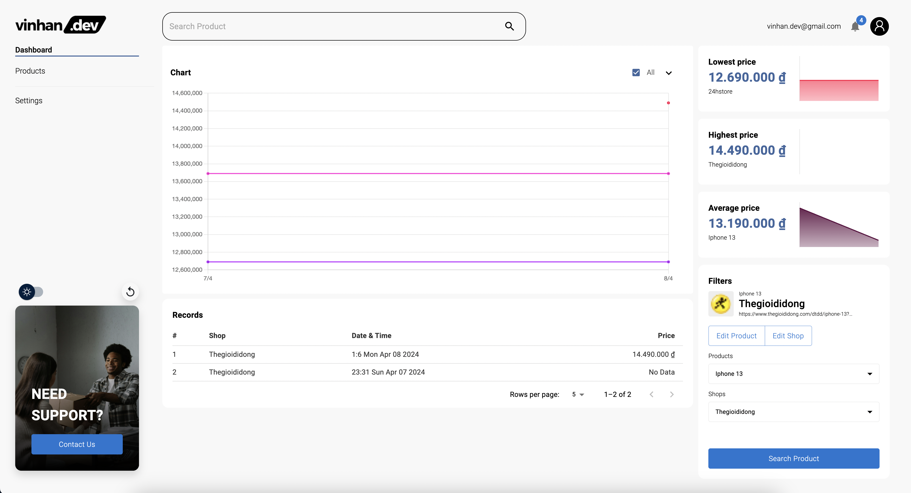
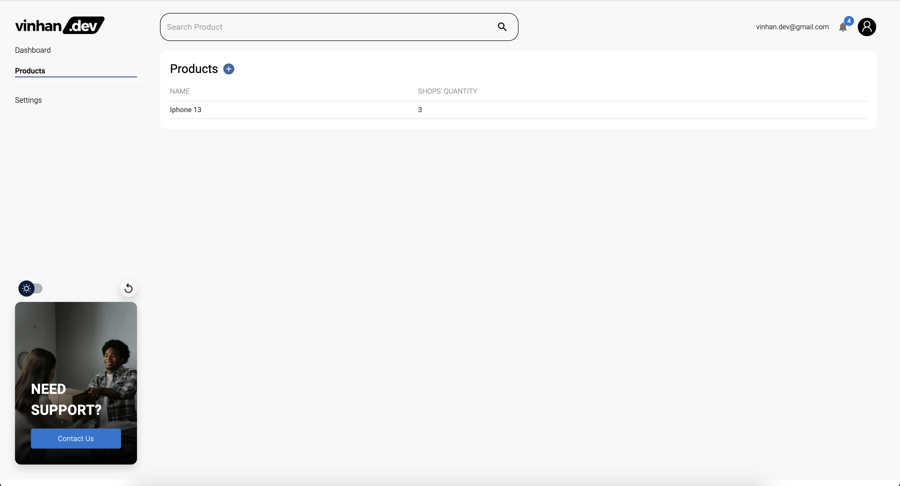
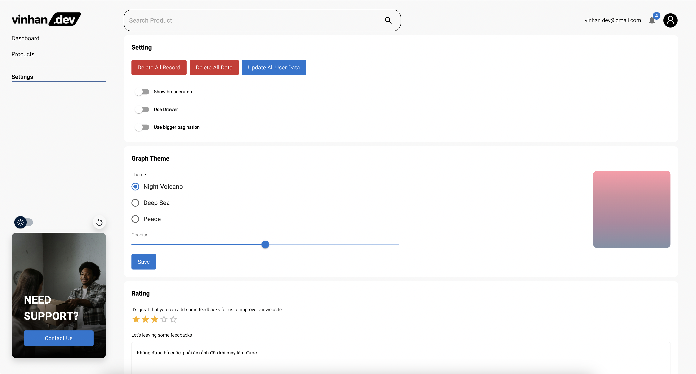
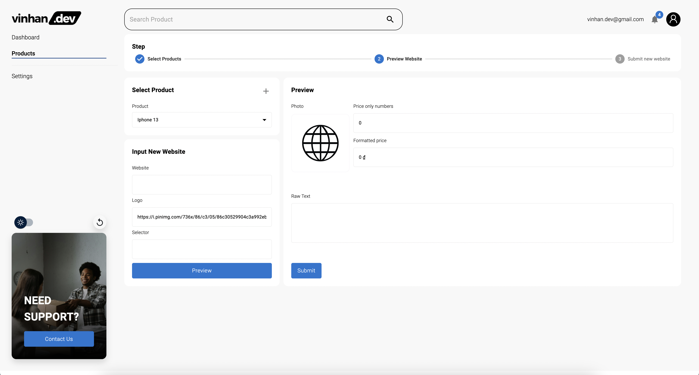
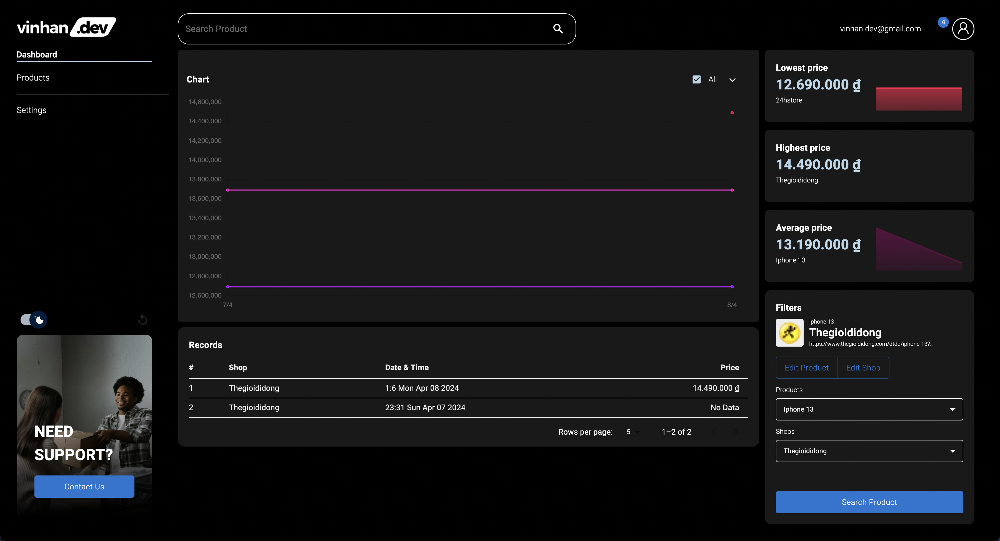

# Track and saved your product's websites price everyday 

This is a ReactJS website help you track your product's price. Specially, it contain all feature from Material UI !.

Additional features:

- [Material UI](https://mui.com/) and [Bootstrap](https://getbootstrap.com/) for layout
- [Vite](https://vitejs.dev/) build source tool
- [Firebse](https://firebase.google.com/) for authentication, database, image stored.
- [React ChartJS](https://react-chartjs-2.js.org/) build camera in app for capture image
- [Zuntand](https://redux.js.org/introduction/getting-started) and [MMKV](https://github.com/mrousavy/react-native-mmkv) for state management
- [React Hook Form](https://expo.dev/@indiespirit/react-native-chart-kit) as [zod](https://zod.dev/) for form validation

## Screenshots

## Demo

